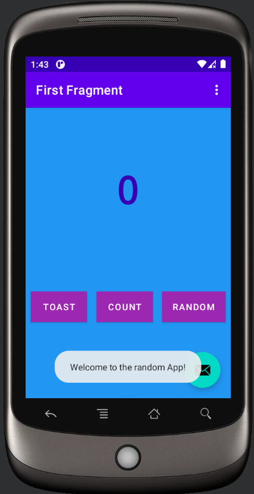

# Random Number Generator App (RNG App)
## Explanation
A simple application &nbsp;⮕&nbsp; Generates a random number between 0 and a given number.

Apart from generating a random number, there is also: 
- A toast button &nbsp;⮕&nbsp; Gives you a welcome message 😁
- A count button &nbsp;⮕&nbsp; Every tap increments the upper bound by **1**

###### Library used: [Safe Args](https://developer.android.com/guide/navigation/navigation-pass-data)

Classpath used:
```
buildscript {
    repositories {
        google()
    }
    dependencies {
        def nav_version = "2.4.2"
        classpath "androidx.navigation:navigation-safe-args-gradle-plugin:$nav_version"
    }
}
```
Plugin used:
```
id 'androidx.navigation.safeargs'
```

## Screenshots
###### Home Screen


###### Welcome Message & Counter

&nbsp;&nbsp;&nbsp;&nbsp;&nbsp;&nbsp;&nbsp;

###### Random Number 🔟


